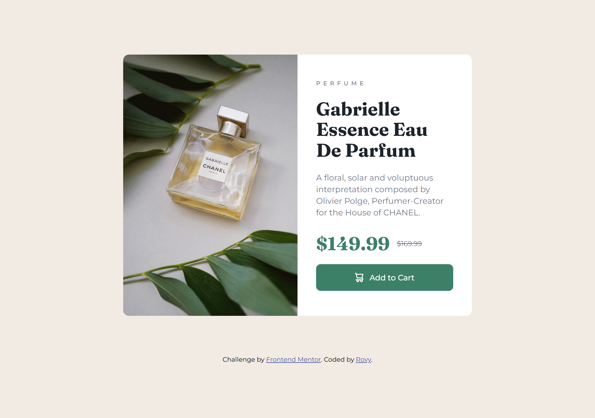

# Frontend Mentor - Product preview card component solution

This is a solution to the [Product preview card component challenge on Frontend Mentor](https://www.frontendmentor.io/challenges/product-preview-card-component-GO7UmttRfa). Frontend Mentor challenges help you improve your coding skills by building realistic projects. 

## Table of contents

- [Overview](#overview)
  - [The challenge](#the-challenge)
  - [Screenshot](#screenshot)
  - [Links](#links)
- [My process](#my-process)
  - [Built with](#built-with)
  - [What I learned](#what-i-learned)
  - [Continued development](#continued-development)
  - [Useful resources](#useful-resources)
  - [AI Collaboration](#ai-collaboration)
- [Author](#author)
- [Acknowledgments](#acknowledgments)

## Overview

### The challenge

Users should be able to:

- View the optimal layout depending on their device's screen size
- See hover and focus states for interactive elements

### Screenshot

### Links

- Solution URL: [Github repository](https://github.com/rovyhonolario53-code/product-preview-card-component-frontend-mentor)
- Live Site URL: [Github pages](https://rovyhonolario53-code.github.io/product-preview-card-component-frontend-mentor/)

## My process

### Built with

- Semantic HTML5 markup
- Flexbox
- CSS Grid
- Mobile-first workflow
- SCSS

### What I learned

- **SCSS**

For this project I tried to use SCSS as I figured out it fits well with responsive development. As well as to expand my skills and stack. SCSS or Sassy CSS is a CSS extension where you have a .scss file, a compiler while compile it to vanilla CSS. It allows us to use variables, improved calculations, nesting, and mixins. Resulting to a more efficient, improved quality, and less repetition.

- **Google fonts**

I also learned to link and get embed codes for fonts in Google Fonts. Allowing me to link the necessary fonts for this project.

- **BEM Naming**

I thought BEM naming is only used with SCSS. Turns out it is used in different parts of programming.

### Continued development

- Split SCSS as projects get bigger.
- Be more accurate regarding sizes.
- Try to be faster doing projects while not losing quality.

### Useful resources

- [Sass documentation](https://sass-lang.com/documentation/) - Helped me understand variables, nesting, and mixins with `@content`.
- [Google Fonts](https://fonts.google.com/) - Where I got the embed code for Fraunces and Montserrat.

### AI Collaboration

**Copilot**

- Used to give feedback regarding sizes and structure.
- Though I think it hallucinated because it still tells me to do something that already existed in the HTML or SCSS.

**Claude**

- Used to relearn SCSS syntax and functions.
- Double check right way of using SCSS.
- Also gave feedback regarding approximates and estimates.

## Author

- Frontend Mentor - [@Rovy Rain](https://www.frontendmentor.io/profile/rovyhonolario53-code)
- Github - [@rovyhonolario53-code](https://github.com/rovyhonolario53-code)

